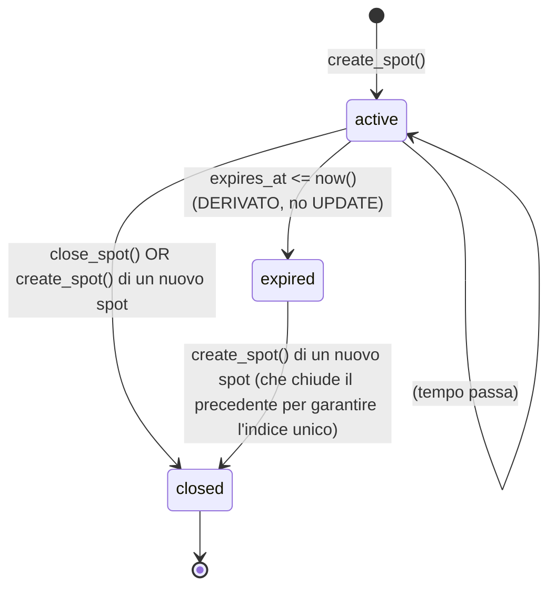

# Data Model — Cluster Spots

**Feature**: 001-cluster-spots
**Date**: 2026-04-10
**Schema**: `public`

Schema, indici, vincoli, RLS e modifiche a tabelle esistenti per la feature Cluster Spots. Allineato con [spec.md](./spec.md) e [research.md](./research.md).

---

## 1. Nuova tabella `public.repeater_spots`

| Colonna | Tipo | Nullable | Default | Note |
|---------|------|----------|---------|------|
| `id` | `uuid` | NO | `gen_random_uuid()` | PK |
| `user_id` | `uuid` | NO | — | FK → `auth.users(id)` ON DELETE CASCADE |
| `repeater_id` | `uuid` | NO | — | FK → `public.repeaters(id)` ON DELETE CASCADE; parte della composite FK con `access_id` |
| `access_id` | `uuid` | YES | NULL | FK composite `(access_id, repeater_id)` → `public.repeater_access(id, repeater_id)` ON DELETE SET NULL — garantisce che l'access scelto appartenga al `repeater_id` dello spot. SET NULL → lo spot diventa "generico" se l'access viene rimosso (vedi edge case spec) |
| `callsign_snapshot` | `text` | NO | — | **Snapshot immutabile** del callsign dell'autore al momento della creazione dello spot. Popolato dalla RPC `create_spot` leggendo `profiles.callsign`. Preserva il callsign storico anche se l'utente lo modifica successivamente nel profilo. Soddisfa FR-012 "callsign al momento della creazione". |
| `started_at` | `timestamptz` | NO | `now()` | Orario di inizio (autorevole lato server) |
| `duration_minutes` | `smallint` | NO | — | CHECK BETWEEN 1 AND 600 |
| `expires_at` | `timestamptz` | NO | — | **Generated column** (`STORED`): `started_at + (duration_minutes \|\| ' minutes')::interval` |
| `closed_at` | `timestamptz` | YES | NULL | Valorizzata su chiusura manuale o sostituzione automatica (RPC `create_spot` chiude il precedente prima di inserire il nuovo) |
| `closed_by` | `uuid` | YES | NULL | FK → `auth.users(id)` ON DELETE SET NULL — **Forward-compat, non mandato da FR-012.** In v1 vale sempre `user_id` o `NULL` (nessun admin moderation). Esiste per simmetria con `closed_at` e per futura estensione a moderazione. |
| `created_at` | `timestamptz` | NO | `now()` | Timestamp di INSERT, immutabile |

### CHECK constraints

```sql
CONSTRAINT repeater_spots_duration_check
  CHECK (duration_minutes BETWEEN 1 AND 600),

CONSTRAINT repeater_spots_temporal_check
  CHECK (closed_at IS NULL OR closed_at >= started_at),

CONSTRAINT repeater_spots_closed_by_consistency_check
  CHECK (closed_by IS NULL OR closed_at IS NOT NULL)
```

### Foreign keys

```sql
-- user_id: cascade hard delete (Q1 clarification)
CONSTRAINT repeater_spots_user_id_fkey
  FOREIGN KEY (user_id) REFERENCES auth.users(id) ON DELETE CASCADE,

-- repeater_id: cascade. Operazionalmente i ponti vengono soft-disabled
-- via repeaters.is_active=false (no FK fire); Q4 garantisce che gli spot
-- restino fino a scadenza naturale in quel caso. CASCADE protegge il
-- raro hard-delete admin ed è coerente con user_favorite_repeaters.
CONSTRAINT repeater_spots_repeater_id_fkey
  FOREIGN KEY (repeater_id) REFERENCES public.repeaters(id) ON DELETE CASCADE,

-- access_id (composite FK): garantisce dichiarativamente coerenza
-- access ↔ repeater. ON DELETE SET NULL preserva lo storico se l'access
-- viene rimosso dal catalogo (lo spot diventa "generico").
CONSTRAINT repeater_spots_access_repeater_fkey
  FOREIGN KEY (access_id, repeater_id)
  REFERENCES public.repeater_access(id, repeater_id)
  ON DELETE SET NULL,

-- closed_by: nullato se l'utente che ha chiuso viene cancellato.
CONSTRAINT repeater_spots_closed_by_fkey
  FOREIGN KEY (closed_by) REFERENCES auth.users(id) ON DELETE SET NULL
```

### Stato derivato (vedi research §1)

Lo stato non è una colonna persistita. Calcolato a runtime:

| Stato logico | Predicato SQL |
|---|---|
| `active` | `closed_at IS NULL AND expires_at > now()` |
| `expired` | `closed_at IS NULL AND expires_at <= now()` |
| `closed` | `closed_at IS NOT NULL` |

Documentato per i client in [contracts/rest.md](./contracts/rest.md).

---

## 2. Indici

```sql
-- (a) Spot di un ponte ordinati per recenza — drive di FR-013 (scheda dettaglio ponte)
CREATE INDEX IF NOT EXISTS idx_spots_repeater_started
  ON public.repeater_spots (repeater_id, started_at DESC);

-- (b) Ultimi spot globali — drive di FR-014 (sezione "Ultimi spot 24h")
CREATE INDEX IF NOT EXISTS idx_spots_started
  ON public.repeater_spots (started_at DESC);

-- (c) Vincolo "1 spot attivo per utente" + lookup veloce — drive di SC-006
CREATE UNIQUE INDEX IF NOT EXISTS idx_spots_active_per_user
  ON public.repeater_spots (user_id)
  WHERE closed_at IS NULL;
```

> **Asimmetria intenzionale** (research §2): l'indice unico considera "attivo" qualsiasi spot con `closed_at IS NULL`, anche se naturalmente scaduto. La RPC `create_spot` chiude **sempre esplicitamente** lo spot precedente prima di inserirne uno nuovo, quindi l'INSERT non viola mai l'unique.

---

## 3. Modifiche a tabelle esistenti

### 3.1 `public.profiles`

```sql
ALTER TABLE public.profiles
  ADD COLUMN IF NOT EXISTS cluster_notifications_enabled boolean NOT NULL DEFAULT true;

COMMENT ON COLUMN public.profiles.cluster_notifications_enabled IS
  'Global opt-out for cluster spot push notifications. Default: true.';
```

**Impatto**: nessun breaking change. I profili esistenti ricevono `true` per default → nessun utente perde silenziosamente le notifiche.

### 3.2 `public.user_favorite_repeaters`

```sql
ALTER TABLE public.user_favorite_repeaters
  ADD COLUMN IF NOT EXISTS cluster_notifications_enabled boolean NOT NULL DEFAULT true;

COMMENT ON COLUMN public.user_favorite_repeaters.cluster_notifications_enabled IS
  'Per-favorite opt-out for cluster spot push notifications on this specific repeater. Default: true.';
```

**Impatto**: nessun breaking change. I preferiti esistenti ricevono `true` → opt-in by default come da spec.

### 3.3 `public.repeater_access`

```sql
ALTER TABLE public.repeater_access
  ADD CONSTRAINT IF NOT EXISTS repeater_access_id_repeater_unique UNIQUE (id, repeater_id);
```

**Razionale**: `id` è già PK, ma Postgres richiede una UNIQUE/PRIMARY KEY constraint a (id, repeater_id) per essere referenziata da una composite FK. Nessun cambio comportamentale, solo metadato di catalogo.

> **Nota di idempotenza**: PostgreSQL non supporta `ADD CONSTRAINT IF NOT EXISTS` direttamente per UNIQUE. La migration usa il pattern:
> ```sql
> DO $$
> BEGIN
>   IF NOT EXISTS (
>     SELECT 1 FROM pg_constraint
>     WHERE conname = 'repeater_access_id_repeater_unique'
>   ) THEN
>     ALTER TABLE public.repeater_access
>       ADD CONSTRAINT repeater_access_id_repeater_unique UNIQUE (id, repeater_id);
>   END IF;
> END $$;
> ```

---

## 4. Realtime publication

```sql
ALTER PUBLICATION supabase_realtime ADD TABLE public.repeater_spots;
```

**Pattern di idempotenza**:
```sql
DO $$
BEGIN
  IF NOT EXISTS (
    SELECT 1 FROM pg_publication_tables
    WHERE pubname = 'supabase_realtime'
      AND schemaname = 'public'
      AND tablename  = 'repeater_spots'
  ) THEN
    ALTER PUBLICATION supabase_realtime ADD TABLE public.repeater_spots;
  END IF;
END $$;
```

I client si sottoscrivono via `postgres_changes` (vedi [contracts/realtime.md](./contracts/realtime.md)).

---

## 5. Row-Level Security

```sql
ALTER TABLE public.repeater_spots ENABLE ROW LEVEL SECURITY;

-- SELECT: ogni utente autenticato può leggere tutti gli spot.
-- (FR-038 + necessario per realtime e per le viste pubbliche FR-013/FR-014)
CREATE POLICY "authenticated can read all spots"
  ON public.repeater_spots
  FOR SELECT
  TO authenticated
  USING (true);

-- INSERT: nessuna policy diretta. Tutti gli INSERT passano dalla RPC
-- create_spot (SECURITY DEFINER), che applica validazione callsign +
-- chiusura del precedente in modo atomico.

-- UPDATE: solo l'owner può aggiornare il proprio spot, e solo per
-- chiuderlo (la RPC close_spot è SECURITY DEFINER e setta closed_at +
-- closed_by). Anche se la policy ammette update generico, la RPC è il
-- punto di ingresso ufficiale.
CREATE POLICY "users can close own spots"
  ON public.repeater_spots
  FOR UPDATE
  TO authenticated
  USING (auth.uid() = user_id)
  WITH CHECK (auth.uid() = user_id);

-- DELETE: nessuna policy. La chiusura è soft via closed_at.
-- (Solo FK CASCADE da auth.users può cancellare fisicamente — cfr. Q1)
```

**Note di sicurezza**:
- FR-038 garantito da `TO authenticated` su SELECT.
- FR-039 garantito dal `USING (auth.uid() = user_id)` su UPDATE.
- FR-040 e FR-041 sono soddisfatti per costruzione (i flag opt-out sono colonne di `profiles`/`user_favorite_repeaters` già protette dalle policy esistenti su quelle tabelle; nessuna posizione GPS o messaggio libero entra in `repeater_spots`).
- **Nessuna policy admin in v1**: non esiste alcuna policy UPDATE/DELETE per ruoli admin su `repeater_spots`. La moderazione cluster è interamente fuori scope v1 (Q5 clarification, FR-031..FR-035 rimossi). Un futuro reviewer NON deve aggiungerne una senza riaprire il design.

---

## 6. State transitions



**Punti chiave**:
- `expired` è uno stato logico, **non** una transizione fisica. Gli spot scaduti non vengono toccati dal DB.
- `closed` è l'unico stato fisico finale (riga ha `closed_at IS NOT NULL`).
- La RPC `create_spot` "chiude" lo spot precedente dell'utente con `closed_at = now(), closed_by = auth.uid()` — questo genera la transizione `active → closed` o `expired → closed` indistintamente.
- Non esiste mai "due righe attive contemporaneamente" per lo stesso `user_id`: l'indice unico parziale lo impedisce a livello DB.

---

## 7. Validation rules (riepilogo, dettaglio in [contracts/rpc.md](./contracts/rpc.md))

| Regola | Punto di enforcement | Errore |
|---|---|---|
| Utente autenticato | RPC `create_spot` step 1 | `AUTH_REQUIRED` |
| Callsign valorizzato (non blank) | RPC `create_spot` step 2 | `CALLSIGN_REQUIRED` |
| Durata 1–600 min | RPC `create_spot` step 3 + CHECK constraint | `INVALID_DURATION` |
| Repeater esistente | RPC `create_spot` step 4 + FK | `REPEATER_NOT_FOUND` |
| Access (se fornito) appartiene al ponte | RPC `create_spot` step 5 + composite FK | `INVALID_ACCESS` |
| Solo l'owner chiude il proprio spot | RPC `close_spot` step 3 + RLS | `FORBIDDEN` |
| Non si chiude due volte | RPC `close_spot` step 4 | `ALREADY_CLOSED` |
| 1 spot attivo per utente | Indice unico parziale + RPC che pre-chiude | `unique_violation` (race) |
| Access rimosso tra pre-validation e INSERT (race) | Composite FK | `foreign_key_violation` (SQLSTATE 23503) — il client PUÒ trattarlo come `INVALID_ACCESS` retroattivo |

---

## 8. Entity-relationship summary

```text
auth.users
   │
   │ 1 ──┐                                          1 ──┐
   │     │                                              │
   ▼     │                                              │
public.profiles                                          │
   │                                                    │
   │ + cluster_notifications_enabled (NEW, default true)│
   │                                                    │
   │                                                    │
public.user_favorite_repeaters                           │
   │ + cluster_notifications_enabled (NEW, default true)│
   │                                                    │
   │ N:1                                                │
   ▼                                                    │
public.repeaters (esistente, is_active flag)            │
   │                                                    │
   │ 1:N                                                │
   ▼                                                    │
public.repeater_access (esistente)                      │
   │                                                    │
   │ +UNIQUE(id, repeater_id) (NEW, per composite FK)   │
   │                                                    │
   │                                                    │
   ▼                                                    ▼
public.repeater_spots (NEW)
   │
   │  user_id   → auth.users (CASCADE)
   │  repeater_id → repeaters (CASCADE)
   │  (access_id, repeater_id) → repeater_access (SET NULL on access del.)
   │  closed_by → auth.users (SET NULL)
   │
   │  Trigger AFTER INSERT
   ▼
public.notify_favorites_on_spot()
   │
   │  INSERT INTO public.user_notifications (filtered by opt-in flags)
   ▼
public.user_notifications (esistente)
   │
   │  Trigger trg_user_notification_push (esistente)
   ▼
edge function send_notification (esistente, via pg_net)
   │
   ▼
OneSignal → device push
```

---

## 9. Open data questions risolte

| Domanda | Risposta | Riferimento |
|---|---|---|
| Spot scaduti vengono cancellati? | No, mai. `closed_at IS NULL AND expires_at <= now()` resta in tabella. | Spec FR-011 |
| Cancellazione account → spot? | Hard delete cascade. | Q1 clarification, FR-011a |
| Disattivazione ponte → spot? | Soft `is_active=false` non triggera FK; spot resta attivo fino a scadenza naturale. Hard delete (raro) → CASCADE. | Q4 clarification |
| Validazione formato callsign? | Solo non-vuoto (trim). Nessuna regex. | Q2 clarification, FR-004 |
| Callsign: snapshot o live? | **Snapshot persistito** nella colonna `callsign_snapshot`. La RPC `create_spot` copia il valore corrente di `profiles.callsign` in `callsign_snapshot` al momento dell'INSERT. Il valore è immutabile; anche se l'utente cambia callsign nel profilo, gli spot storici mantengono il callsign con cui sono stati creati. Soddisfa FR-012 letteralmente. | FR-012, analyze C5 |
| Vista personale "I miei spot"? | Out of scope v1. | Q3 clarification, FR-017a |
| `closed_by` colonna in v1? | Forward-compat surface, non mandato da FR-012. In v1 vale sempre `user_id` o `NULL`. Esiste per simmetria con `closed_at` e per futura estensione a moderazione. | Q5 clarification, analyze C8 |
